<p align="center">
  
</p>

<h1 align="center">Claude Context Governor</h1>

<p align="center">
  <strong>The control plane for Claude Code.</strong>
</p>

<p align="center">
  Run a dozen MCP servers and a hundred skills.<br>
  Pay context for only the ones doing work right now.
</p>

<p align="center">
  
</p>

<p align="center">
  <a href="https://github.com/TribalHouse/claude-context-governor/actions/workflows/ci.yml?branch=main"></a>
  <a href="https://github.com/TribalHouse/claude-context-governor/stargazers"></a>
  <a href="./LICENSE"></a>
  <a href="https://nodejs.org"></a>
</p>

<p align="center">
  <a href="#install">Install</a> ·
  <a href="#configure-backends">Configure</a> ·
  <a href="#the-gov-tools">gov.* tools</a> ·
  <a href="#manage-skills">Skills</a> ·
  <a href="#route-prompts-to-the-right-model">Routing</a> ·
  <a href="#architecture">Architecture</a> ·
  <a href="#faq">FAQ</a> ·
  <a href="./CONTRIBUTING.md">Contributing</a>
</p>

<p align="center">
  <em>New here? Start with <a href="#install">Install</a> → <a href="#configure-backends">Configure backends</a> → <a href="#route-prompts-to-the-right-model">Route prompts</a>.</em>
</p>

---

## The control governor for Claude Code

Your existing MCP servers stay where they are. Your skill library stays where it is. Your hooks stay where they are. The governor sits one layer above them and decides three things:

1. Which MCP backends are awake right now, and which are sleeping.
2. Which skills load into the session prompt, and which sit on disk until called.
3. Which kinds of prompts deserve which model.

Claude Code sees one MCP entry. The governor handles the fan-out, the lifecycle, and the routing. Sessions start fast because dormant capability stops costing tokens.

<p align="center">
  
</p>

## The cost you're paying right now

Every MCP server you've added to Claude Code registers its full tool catalog at session start. Every skill in `~/.claude/skills/` loads its manifest into the system prompt. Every hook fires on every turn. None of that depends on whether you'll use those tools today.

```
                        BEFORE                         AFTER
─────────────────────────────────────  ─────────────────────────────────────
12 MCP servers           ~18,400 tok   1 MCP server               ~2,100 tok
91 skills loaded         ~11,700 tok   24 skills loaded           ~3,200 tok
8 hooks                     ~400 tok   8 hooks                      ~400 tok
─────────────────────────────────────  ─────────────────────────────────────
Session start            ~30,500 tok   Session start              ~5,700 tok
                                                                      (–81%)
```

*Illustrative numbers from a typical power-user setup. Actual savings depend on which backends and skills you run. The governor doesn't make any single tool cheaper to call. It removes the cost of the ones you aren't calling.*

## Highlights

- **[One MCP entry, N backends](#configure-backends).** Multiplex whichever MCP servers you already use (Serena, Context7, Playwright, Supabase, GitHub, Figma, etc.) behind one connection. Nothing extra to install.
- **[Lazy lifecycle](#configure-backends).** `always_on` backends run as launchd services; `on-demand` backends spawn on first call and die after idle.
- **[`gov.*` intent tools](#the-gov-tools).** High-level tools (`gov.search_code`, `gov.search_docs`, `gov.browser_task`, `gov.project_tool`) that route to your backends.
- **[Skill governor](#manage-skills).** Move skills between `~/.claude/skills/` (loaded) and `~/.claude/skills-inactive/` (parked) with one command.
- **[Prompt routing](#route-prompts-to-the-right-model).** Regex classifier tags risky work for Opus, read-only work for Haiku, everything else for Sonnet.
- **[Secret hygiene](#faq).** `${ENV_VAR}` placeholders expand at connect time; logs auto-redact Bearer tokens, JWTs, and `key=value` patterns.
- **[Reversible install](#why-a-governor-not-another-tool).** Uninstall in 30 seconds; the installer writes a `settings.json.backup-*` file before patching.

## What it is

Not another MCP server. Not a skill collection. Not a Claude Code fork.

Context Governor is the layer that sits between Claude Code and everything else. Claude Code sees one MCP entry. Behind that entry, the governor:

- **Multiplexes MCP traffic.** N backends, one connection upstream. Tools surface only when their backend is registered.
- **Lifecycles backends.** Always-on backends run as `launchd` services and stay warm. On-demand backends spawn on first call and die after an idle timeout. Disabled backends list nothing.
- **Governs skills.** `~/.claude/skills/` auto-loads; `~/.claude/skills-inactive/` doesn't. Move a skill between them with one command.
- **Classifies prompts.** A `UserPromptSubmit` hook tags risky work (auth, schema, billing, large refactor) for Opus and read-only work (why, what, find, summarize) for Haiku. The agent reads the tag and decides.
- **Redacts secrets.** Bearer tokens, JWTs, and `key=value` patterns get stripped before anything reaches `governor.log`. Log rotates at 2 MB.
- **Expands env vars.** Put `${EXAMPLE_API_TOKEN}` in your registry; the governor resolves it at connect time. Secrets live in your shell, never in JSON.

The whole thing is one Node process behind one `mcpServers` entry. No daemon to babysit, no proprietary protocol, no lock-in.

## Why a governor, not another tool

Every MCP server you've installed is a good tool. Every skill in your library is a good prompt. The problem isn't your tools. The problem is that Claude Code loads all of them at session start, whether you'll touch them today or not.

The governor doesn't compete with what you've installed. It decides when each thing earns its space in your current context budget.

A load balancer doesn't replace web servers; it decides which one answers each request. A kernel scheduler doesn't replace processes; it decides which one runs next. The governor works the same way for Claude Code: your backends do the work, your skills carry the prompts, and the governor decides which ones are awake, loaded, and routed for the session you're in right now.

You can uninstall it in 30 seconds. Delete the `mcpServers.context-governor` entry, restore your original MCP entries from the `settings.json.backup-*` file the installer wrote, and you're back where you started. Nothing about your existing setup is destructive or one-way.

## Install

```bash
git clone https://github.com/TribalHouse/claude-context-governor
cd claude-context-governor
node install.mjs
```

The installer is idempotent. It creates the directory layout, copies the CLIs, runs `npm install`, backs up your `~/.claude/settings.json`, adds the one `context-governor` entry, and grants the `mcp__context-governor__*` permission. Re-run any time.

Inspect first:

```bash
node install.mjs --dry-run        # show every action, write nothing
node install.mjs --no-settings    # install files, leave settings.json alone
```

## Configure backends

Drop one block per MCP server you already use into `~/.claude/context-governor/registry.json`. The block tells the governor how to reach the backend and how to manage its lifecycle. **The names below (`serena`, `playwright`, `private-api`) are just example identifiers, not required backends.** Pick whatever names match your setup. Three lifecycle modes:

```jsonc
{
  "serena": {
    "transport": "streamable-http",
    "endpoint": "http://127.0.0.1:12301/mcp",
    "always_on": true
  },

  "playwright": {
    "transport": "stdio",
    "command": "npx",
    "args": ["-y", "@playwright/mcp@latest"],
    "always_on": false,
    "idle_timeout_seconds": 300
  },

  "private-api": {
    "transport": "streamable-http",
    "endpoint": "https://api.example.com/mcp",
    "headers": { "Authorization": "Bearer ${EXAMPLE_API_TOKEN}" },
    "always_on": false,
    "disabled": true
  }
}
```

| Mode | Behavior |
|---|---|
| `always_on: true` | Managed by `launchd`. Reconnects at startup. |
| `always_on: false` | Spawned on first tool call. `SIGTERM`'d after idle. |
| `disabled: true` | Never started. Tools not listed. |

Full schema and worked examples in [`registry.example.json`](./registry.example.json).

## The `gov.*` tools

The agent sees a small set of high-level intent tools that route to whichever backends you've registered. **None of these backends ship with the governor.** Each shortcut appears only if you have a backend by that name in your registry; if you don't, the shortcut simply isn't listed.

| Tool | Routes to a backend named… | Appears when |
|---|---|---|
| `gov.search_code` | `serena` (any code-intelligence MCP) | You've registered a backend named `serena` |
| `gov.search_docs` | `context7` (any docs MCP) | You've registered a backend named `context7` |
| `gov.browser_task` | `playwright` (any browser MCP) | You've registered a backend named `playwright` |
| `gov.project_tool` | any on-demand backend in your registry | You have at least one on-demand backend registered |
| `gov.list_tools` | — | Always |
| `gov.tool_status` | — | Always |
| `gov.cleanup_idle` | — | Always |

In other words: the governor doesn't require Serena, Context7, or Playwright. It just provides nice shortcuts *if* those backends happen to be what you have. Bring your own MCP servers; the `gov.project_tool` target enum is built dynamically from your registry at startup. Add a backend and it appears; remove it and the tool disappears.

For debugging, set `_settings.exposePassthroughTools: true` in the registry; every backend tool surfaces as `backend__toolname`. Off by default to keep the catalog small.

## Manage skills

Two directories. The governor moves directories between them.

```bash
skill-status                     # active + inactive, with [protected] flags
skill-status --search seo        # filter by name
skill-enable seo                 # inactive → active
skill-disable seo                # active → inactive
skill-disable caveman --force    # override protection
skill-use "seo audit"            # resolve alias, enable, print usage
```

Changes take effect after the next `/clear` or session restart.

## Route prompts to the right model

Claude Code ships three model families (Opus, Sonnet, Haiku) and a subagent system that includes read-only scouts. Most teams pick one model and use it for everything because deciding per turn is annoying. The governor encodes a routing policy in regex so the agent does the deciding.

Add this hook to `~/.claude/settings.json`:

```jsonc
{
  "hooks": {
    "UserPromptSubmit": [{
      "matcher": "*",
      "hooks": [{ "type": "command",
        "command": "node ~/.claude/context-governor/hooks/route-prompt.mjs" }]
    }]
  }
}
```

The hook doesn't change the active model. Claude Code's model is session-scoped and only you (or `/model`) can switch it. The hook reads stdin, classifies the text against two pattern lists, and emits at most one line of `[ROUTING ADVICE: ...]` into the agent's context for that turn. The agent reads it and decides whether to `/model`, delegate to a subagent, or stay put.

### The three buckets

**Opus route** (high-risk, plan-first work). Matches `auth`, `migration`, `schema change`, `rls`, `security audit`, `encryption`, `billing`, `payment`, `stripe`, `permissions model`, `large refactor`, `architectural decision`, `failed again`, `audit everything`, and similar phrases. The hook emits:

```
[ROUTING ADVICE: opus — prompt looks high-risk (auth, schema, security,
billing, large refactor, or repeated failure). If not already on Opus,
consider /model opus or delegating to the opus-planner subagent before
editing files. Save the plan to .claude/last-opus-plan.md and wait for
user approval.]
```

This is where `opusplan` mode earns its keep. Claude Code's `opusplan` model auto-handles plan-then-execute handoff: the planner agent writes to `.claude/last-opus-plan.md`, you approve, the builder agent implements. The governor's hook is the trigger that escalates risky prompts into that workflow instead of letting Sonnet improvise.

**Haiku route** (read-only diagnostics, summaries, exploration). Matches prompts starting with `why`, `what`, `where`, `when`, `how`, `which`, `who`, plus `summarize`, `tldr`, `find`, `locate`, `grep`, `where is`, `check the logs`, `diagnose`, `investigate`, `explain this`, `list all`, `read-only`. The hook emits:

```
[ROUTING ADVICE: haiku — prompt looks like read-only diagnostics, summary,
or search. Consider delegating to the haiku-scout / explorer subagent
(Haiku 4.5 — read-only, ~5× cheaper). Do not edit files from the scout
agent.]
```

The `haiku-scout` and `explorer` subagents are read-only by design (no Edit, Write, or NotebookEdit tools). The hook routes log digging, "where is X defined", and noisy summary work to them.

**Sonnet route** (default). Anything that matches neither list. The hook stays silent and Claude Code sees the original prompt unchanged.

### What you can override

The hook is advice, not enforcement. Three layers above it:

- **Manual override** in the prompt: "use sonnet for this" / "use haiku" / "use opus".
- **Session-level**: `/model opus`, `/model sonnet`, `/model haiku`.
- **Agent delegation**: `Agent(subagent_type="haiku-scout", ...)` from Sonnet/Opus regardless of route advice.

The classifier is a starting point, not a verdict. Tune the regex tables in `route-prompt.mjs` to match your team's vocabulary. The file is 111 lines and the patterns are the top half.

### Why this matters for cost

Haiku 4.5 is roughly 5× cheaper than Sonnet per token. Opus is roughly 5× more expensive. A team running every diagnostic prompt through Sonnet by default is overpaying. A team running every auth migration through Sonnet by default is underplanning. The router gets you out of both failure modes without making the user pick a model on every turn.

## Architecture

```
                       ┌──────────────────────────────────┐
                       │           Claude Code            │
                       │       one mcpServers entry       │
                       └────────────────┬─────────────────┘
                                        │  stdio MCP
                                        ▼
   ┌────────────────────────────────────────────────────────────────────┐
   │                        Context Governor                            │
   │                                                                    │
   │   gov.* intent tools     search_code  search_docs  browser_task    │
   │                          project_tool  list_tools  tool_status     │
   │                                                                    │
   │   Control plane          dynamic tool list · env var expansion     │
   │                          per-backend timeouts                      │
   │                                                                    │
   │   Runtime hygiene        secret redaction · 2 MB log rotation      │
   │                          60-second idle cleanup                    │
   └─────┬─────────────────────┬────────────────────────────┬───────────┘
         │                     │                            │
         ▼                     ▼                            ▼
   ╔════════════════════════════════════════════════════════════════════╗
   ║   Whatever MCP servers you already use                             ║
   ║   (none of these ship with the governor — bring your own)          ║
   ║                                                                    ║
   ║   ┌──────────────────┐  ┌──────────────────┐  ┌──────────────────┐ ║
   ║   │ any always_on    │  │ any on-demand    │  │ …and your own    │ ║
   ║   │ backend          │  │ backend          │  │ MCP / API        │ ║
   ║   │                  │  │                  │  │                  │ ║
   ║   │ http or sse      │  │ stdio            │  │ http · sse       │ ║
   ║   │ launchd-managed  │  │ spawned on call  │  │ · stdio          │ ║
   ║   └──────────────────┘  └──────────────────┘  └──────────────────┘ ║
   ╚════════════════════════════════════════════════════════════════════╝
```

The boxes on the bottom row are *examples* of what plugs in, not requirements. The governor doesn't ship any backend. It governs whichever MCP servers and skills you already have installed.

Same protocol on both sides. The MCP SDK supports server and client roles in the same process; the governor uses both. No translation layer, no proprietary wire format.

## FAQ

**Do parked skills still work?**
Yes. `skill-enable <name>` or `skill-use <alias>` moves the directory back. Once loaded, the skill behaves the same as if it had always been active.

**What if a backend is down?**
The governor logs the error and keeps running. Tools from that backend won't list; calls to them return a clear error. Other backends keep working.

**Linux?**
The governor and skill CLIs work on Linux. The `mcpd/` launchd scripts are macOS-only; a systemd port for always-on backends is on the roadmap. On-demand backends already work everywhere.

**Where are the secrets?**
In your shell. Put `${VAR_NAME}` in registry headers; the governor expands them at connect time. They never get written to `registry.json` or `governor.log` (the log redactor strips Bearer tokens, JWTs, and common `key=value` patterns before write).

**Why one aggregator instead of N MCP entries?**
Each `mcpServers` entry opens a connection at session start and registers its tool list. That cost is fixed per backend. One aggregator pays it once.

## Roadmap

- [ ] Linux `mcpd` (systemd units to replace launchd plists)
- [ ] Health checks and auto-restart for always-on services
- [ ] Per-backend rate limits in the registry
- [ ] Mock-MCP test harness

Open an issue if you'd take one.

## License

MIT. See [LICENSE](./LICENSE).

## Related projects

- [Model Context Protocol](https://github.com/modelcontextprotocol). The protocol Claude Code uses to talk to external tools.
- [Anthropic Claude Code](https://docs.claude.com/en/docs/claude-code). The CLI this plugs into.
- [Awesome MCP Servers](https://github.com/punkpeye/awesome-mcp-servers). A catalog of backends you can register with the governor.

<details>
<summary><strong>Keywords for search</strong></summary>

Claude Code MCP aggregator, Claude Code MCP router, MCP gateway, MCP proxy, multiple MCP servers, MCP server manager, Anthropic Claude Code plugin, Claude Code context optimization, Claude Code token budget, Claude Code subagent routing, Opus Sonnet Haiku router, opusplan workflow, Claude skill manager, `~/.claude/skills` manager, `UserPromptSubmit` hook, model context protocol router, Claude Code session startup cost, lazy load MCP, on-demand MCP server, launchd MCP daemon.

</details>

---

<p align="center">
  Built by <a href="https://github.com/TribalHouse">Nour Beiruti</a> at <a href="https://tribalhousestudios.com">TribalHouse</a>.
</p>

<p align="center">
  <sub>
    If this saves your context window, give the repo a ⭐ so others find it.
  </sub>
</p>

<br>

<p align="center">
  
</p>

<!--
Maintainer notes:

GitHub repo topics to set (Settings → About → Topics):
  claude-code, mcp, mcp-server, mcp-aggregator, mcp-router, anthropic,
  ai-agents, subagents, prompt-routing, context-management,
  token-optimization, claude-code-plugin, llm-tools, developer-tools

Social preview image (Settings → Social preview):
  upload docs/assets/social-preview.png (1280×640) when available.
-->
